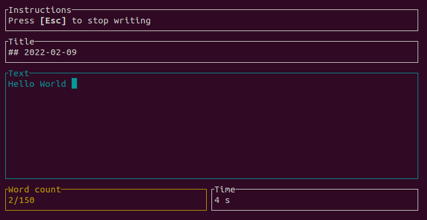

# writingbuddy

Simple command line tool to help you establish a daily writing habit. Use it for journaling, 
writing your book or doing daily blogging.

## Features

- Uses simple markdown files to store text
- Define a goal of how many words you want to write
- Define a goal of how long you want to write
- 'Strict mode' that does not let you leave before you reach your defined goals
- A keystroke timer that forces you to keep on writing and will delete your Text if you stop typing for too long.
- Append text to existing markdown file
- Define your own title and filename patterns
- Option to disable backspace key in order to focus on writing

